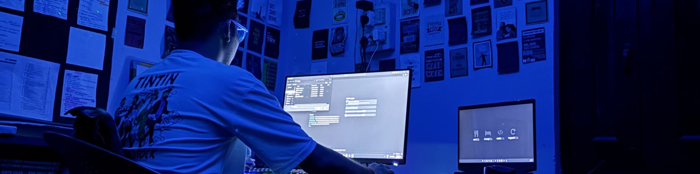

  

<h1 align="center">Hi there, I'm Aditya Mishra 👋</h1>

  <i>Software Developer | Full Stack Developer | MERN Stack Developer | React.js | Express.js | Nodejs | MongoDB | SQL</i>

---

## 🎯 About Me

- 🔭 Currently building scalable full-stack applications with a strong focus on React.js and front-end technologies.
- 🌱 Exploring advanced topics in performance optimization, responsive design, and system scalability.
- 💬 Ask me about: React.js, Node.js, MongoDB, Agile workflows, and building user-centric UIs.
- 🤝 Proven track record of effective collaboration, time management, and solving real-world technical challenges.
- 📫 Reach me at: [adityaamishraaa11@gmail.com](mailto:adityaamishraaa11@gmail.com)
- 🧠 Fun Fact: I love converting ideas into scalable tech solutions 🚀

---

## 🧠 Skills & Tools

### Programming Languages  

  
  
  
  

### Web & Frameworks  

  
  
  
  

### Databases & Cloud  

  
  

### Dev Tools  

  
  

---

## 📫 Connect With Me

  &nbsp;
  &nbsp;
  &nbsp;
  &nbsp;
  &nbsp;
  &nbsp;
  

---

  

## 🌐 Socials:
   

# 💻 Tech Stack:
 
 
 
 
 
 
 
 
 
 
 
 
 
 
 

# 📊 GitHub Stats:
 
 

## 🏆 GitHub Trophies

### 🔝 Top Contributed Repo

---

<!-- Proudly created with GPRM ( https://gprm.itsvg.in ) -->
